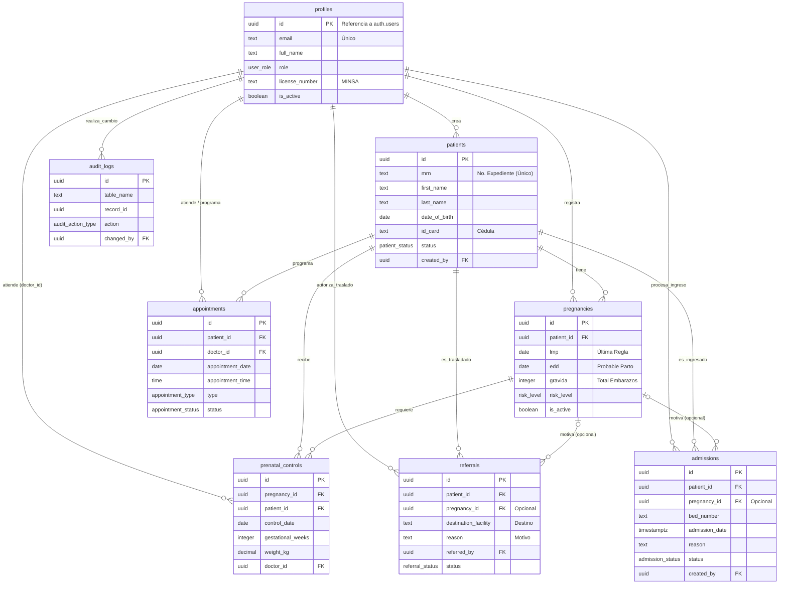

# Diagrama de Base de Datos - SIACEM
*Diagrama Entidad-Relación (ERD) del Sistema Inteligente Automatizado para el Control de Expedientes Médicos*

A continuación se presenta el diagrama visual que representa las tablas de la base de datos, sus campos principales y cómo se relacionan entre sí.

> [!NOTE]
> **Convenciones del Diagrama:**
> - **PK**: Llave Primaria (Identificador único de la tabla).
> - **FK**: Llave Foránea (Referencia a un registro en otra tabla).
> - La notación `||--o{` significa que "1 registro de la primera tabla puede estar relacionado con 0 o muchos registros de la segunda tabla" (Relación 1 a muchos).
> - La notación `|o--o{` significa que "es opcional en la primera tabla y puede tener muchos en la segunda".
